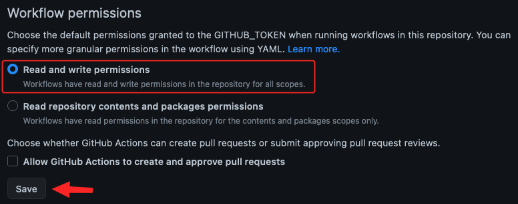
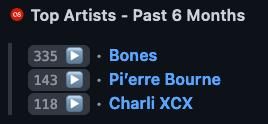
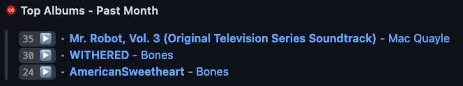
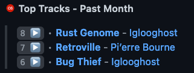
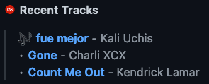

<p align="center"></p>
<div align="center">

# GitHub README Last.fm Metrics
A GitHub Action to dynamically update your GitHub `README.md` with [Last.fm](https://www.last.fm) metrics.

[![MIT][license.badge]][license] [![github.release.badge]][github.release]

[![actions.ci.badge]][actions.ci] [![actions.codegl.badge]][actions.codegl] [![codecov.badge]][codecov]
</div>

## ⚡ Usage

### Preparation

#### <ins>Last.fm API Key</ins>
Create a [Last.fm API account](https://www.last.fm/api/account/create) if you don't have one to receive an **API Key**.
> You don't need to fill out every field on the form, the `Contact email` and `Application name` alone are sufficient.

#### <ins>Save GitHub Action Secrets</ins>
Navigate to your repositories `Settings → Secrets and variables → Actions → New repository secret` to add the following secrets:

|       Name       |                        Value                        |
|:----------------:|:---------------------------------------------------:|
| `LASTFM_API_KEY` |             A valid **Last.fm API Key**             |
|   `GH_TOKEN`*    | A GitHub Access Token with the `repo` scope granted |

> \* `GH_TOKEN` is only required when the intention is to modify a `README.md` file in a repository outside where the workflow is running.


#### <ins>Update the workflow permissions for the repository</ins>

Navigate to your repositories `Settings → Actions → General → Workflow permissions` and select the **Read and write permissions** option.



#### <ins>Add chart HTML comments to your README</ins>

The `README.md` file must contain HTML comments that identify where the charts should be inserted. Commonly, a [profile repository](https://docs.github.com/en/account-and-profile/setting-up-and-managing-your-github-profile/customizing-your-profile/managing-your-profile-readme) is used to host the `README.md` file.

> See the [Charts](#-charts) section for configuration details.

### Example Workflow

```yaml
name: Last.fm Charts

on:
  workflow_dispatch: # Allow manual triggering of workflow
  schedule:
    # Run every day at midnight
    - cron: '0 0 * * *'

jobs:
  lastfm-metrics:
    name: Update Last.fm Charts
    runs-on: ubuntu-latest
    steps:
      - uses: dxnter/lastfm-readme@v1
        with:
          LASTFM_API_KEY: ${{ secrets.LASTFM_API_KEY }}
          LASTFM_USER: dxnter
          # The following inputs below are only required when the intention is to modify a README.md file in a repository outside where the workflow is running
          #GH_TOKEN: ${{ secrets.GH_TOKEN }}
          #REPOSITORY: <gh_username/gh_username>
```

### Inputs

|     Setting      |            Default             |       Accepted Values       |                        Description                        |
|:----------------:|:------------------------------:|:---------------------------:|:---------------------------------------------------------:|
| `LASTFM_API_KEY` |              N/A               |       Last.fm API Key       |                A valid **Last.fm API Key**                |
|  `LASTFM_USER`   |              N/A               |      Last.fm username       |          The Last.fm user to fetch metrics from           |
|    `GH_TOKEN`    |     `${{ github.token }}`      |     GitHub access token     |      An access token with the `repo` scope granted.       |
|   `REPOSITORY`   | `<gh_username>/<gh_username>`  | `<gh_username>/<repo_name>` | Repository that should have the `README.md` file updated. |
| `COMMIT_MESSAGE` | `chore: update Last.fm charts` |         Any string          |    Commit message used when chart metrics are updated     |
|   `SHOW_TITLE`   |             `true`             |      `true` / `false`       |        Toggle the title shown above chart sections        |

## 📊 Charts

All charts are identified by HTML comments that contain a valid chart name and an **optional** JSON configuration object followed by a closing HTML comment.

```html
Chart with the default configuration (period: "7day", rows: 8)
<!--START_LASTFM_...-->
<!--END_LASTFM_...-->

Chart with a custom configuration
<!--START_LASTFM_...:{"period": "overall", "rows": 3}-->
<!--END_LASTFM_...-->
```

### 🎤️ Top Artists

Display the top listened to artists over a given period of time.

#### <ins>Example</ins>

```html
<!--START_LASTFM_ARTISTS:{"period": "6month", "rows": 3}-->
<!--END_LASTFM_ARTISTS-->
```

#### <ins>Output</ins>




#### <ins>Configuration</ins>

|  Option  | Default |                          Options                           |               Description               |
|:--------:|:-------:|:----------------------------------------------------------:|:---------------------------------------:|
| `period` | `7day`  | `7day`, `1month`, `3month`, `6month`, `12month`, `overall` | The period of time to display data from |
|  `rows`  |   `8`   |                      1 ≤ integer ≤ 50                      |    The number of artists to display     |


### 💿 Top Albums

Display the top listened to albums over a given period of time.

#### <ins>Example</ins>

```html
<!--START_LASTFM_ALBUMS:{"period": "1month", "rows": 3}-->
<!--END_LASTFM_ALBUMS-->
```

#### <ins>Output</ins>



#### <ins>Configuration</ins>

|  Option  | Default |                          Options                           |               Description               |
|:--------:|:-------:|:----------------------------------------------------------:|:---------------------------------------:|
| `period` | `7day`  | `7day`, `1month`, `3month`, `6month`, `12month`, `overall` | The period of time to display data from |
|  `rows`  |   `8`   |                      1 ≤ integer ≤ 50                      |     The number of albums to display     |

### 🎵 Top Tracks

Display the top listened to tracks over a given period of time.

#### <ins>Example</ins>

```html
<!--START_LASTFM_TRACKS:{"period": "1month", "rows": 3}-->
<!--END_LASTFM_TRACKS-->
```

#### <ins>Output</ins>



#### <ins>Configuration</ins>

|  Option  | Default |                          Options                           |               Description               |
|:--------:|:-------:|:----------------------------------------------------------:|:---------------------------------------:|
| `period` | `7day`  | `7day`, `1month`, `3month`, `6month`, `12month`, `overall` | The period of time to display data from |
|  `rows`  |   `8`   |                      1 ≤ integer ≤ 50                      |     The number of tracks to display     |

### 🔊 Recent Tracks

Display recently listened to tracks.

#### <ins>Example</ins>

```html
<!--START_LASTFM_RECENT:{"rows": 3}-->
<!--END_LASTFM_RECENT-->
```

#### <ins>Output</ins>

**Default**


**Track currently playing**



#### <ins>Configuration</ins>

|  Option  | Default |                          Options                           |              Description               |
|:--------:|:-------:|:----------------------------------------------------------:|:--------------------------------------:|
|  `rows`  |   `8`   |                      1 ≤ integer ≤ 50                      | The number of recent tracks to display |

## Acknowledgements

- [JasonEtco/rss-to-readme](https://github.com/JasonEtco/rss-to-readme)
- [vnphanquang/monkeytype-readme](https://github.com/vnphanquang/monkeytype-readme)
- [athul/waka-readme](https://github.com/athul/waka-readme)
- [actions-js/profile-readme](https://github.com/actions-js/profile-readme)

[license.badge]: https://img.shields.io/badge/license-MIT-blue.svg
[license]: ./LICENSE

[github.release.badge]: https://img.shields.io/github/v/release/dxnter/lastfm-readme
[github.release]: https://github.com/dxnter/lastfm-readme/releases

[actions.ci.badge]: https://github.com/dxnter/lastfm-readme/actions/workflows/ci.yaml/badge.svg
[actions.ci]: https://github.com/dxnter/lastfm-readme/actions/workflows/ci.yaml

[actions.codegl.badge]: https://github.com/dxnter/lastfm-readme/actions/workflows/codegl.yaml/badge.svg
[actions.codegl]: https://github.com/dxnter/lastfm-readme/actions/workflows/codegl.yaml

[codecov.badge]: https://codecov.io/github/dxnter/lastfm-readme/coverage.svg?branch=main
[codecov]: https://codecov.io/github/dxnter/lastfm-readme?branch=main
