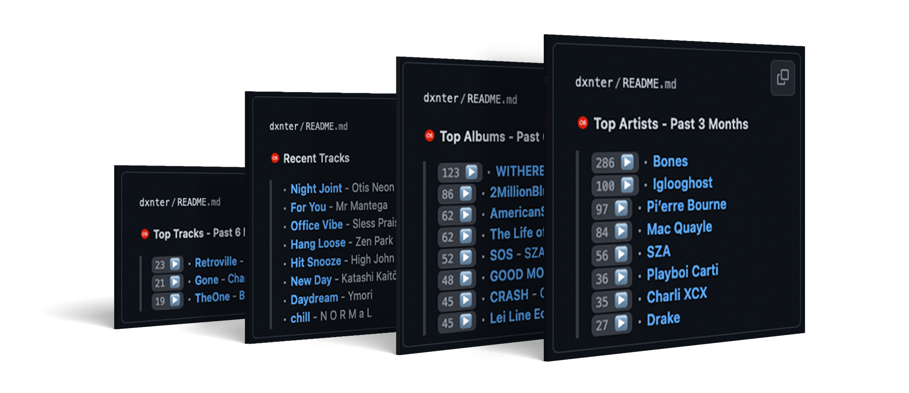

<div align="center">
  

  # 🎵 Last.fm README GitHub Action

  **Dynamically update your GitHub `README.md` with [Last.fm](https://www.last.fm) metrics.**

  [![MIT License][license.badge]][license]
  [![GitHub Release][github.release.badge]][github.release]
</div>

<div align="center">
  
</div>

## 🚀 Quick Start

> [!TIP]
> **New to GitHub Actions?** Check out the [GitHub Actions documentation](https://docs.github.com/en/actions) to get started.

### 🔧 Setup

#### 🎵 Last.fm API Key

1. **Create a Last.fm API account**: Visit [Last.fm API](https://www.last.fm/api/account/create)
2. **Get your API key**: You'll receive an API key immediately after account creation
3. **Save your API key**: You'll need this for the next step

> [!WARNING]
> Keep your API key secure and never commit it directly to your repository.

#### 🔒 Configure Repository Secrets

**Step 1**: Navigate to your repository's secrets:

```
Your Repository → Settings → Secrets and variables → Actions → New repository secret
```

**Step 2**: Add the required secrets:

<table>
<thead>
<tr><th width="200px">Secret Name</th><th>Description</th><th>Required</th></tr>
</thead>
<tbody>
<tr>
<td><code>LASTFM_API_KEY</code></td>
<td>Your Last.fm API key from the previous step</td>
<td>✅ Yes</td>
</tr>
<tr>
<td><code>GH_TOKEN</code></td>
<td>GitHub Personal Access Token with <code>repo</code> scope<br/><small><em>Only needed for cross-repository updates</em></small></td>
<td>⚠️ Conditional</td>
</tr>
</tbody>
</table>

#### ⚙️ Configure Workflow Permissions

> [!IMPORTANT]
> This step is crucial for the action to update your README file.

**Path**: `Settings → Actions → General → Workflow permissions`

**Setting**: Select **"Read and write permissions"**

<div align="center">
  
</div>

#### 📝 Add Section Markers to Your README

Add HTML comments to your `README.md` where you want your Last.fm data to appear:

```html
<!-- Add this where you want your music stats -->
<!--START_LASTFM_ARTISTS-->
<!--END_LASTFM_ARTISTS-->

<!--START_LASTFM_RECENT-->
<!--END_LASTFM_RECENT-->
```

### 💼 Create Your Workflow

Create `.github/workflows/lastfm.yml` in your repository:

```yaml
name: 🎵 Update Last.fm Stats

on:
  # Run automatically every 6 hours
  schedule:
    - cron: '0 */6 * * *'
  # Allow manual runs
  workflow_dispatch:

jobs:
  update-lastfm:
    name: 🎤 Update Music Stats
    runs-on: ubuntu-latest

    steps:
      - name: 🎵 Update Last.fm README
        uses: dxnter/lastfm-readme@v1
        with:
          LASTFM_API_KEY: ${{ secrets.LASTFM_API_KEY }}
          LASTFM_USER: your-lastfm-username

          # Optional: Customize the commit message
          COMMIT_MESSAGE: '🎵 Update music stats'

          # Optional: For cross-repository updates
          # GH_TOKEN: ${{ secrets.GH_TOKEN }}
          # REPOSITORY: username/repository

          # Optional: Target a different file
          # TARGET_FILE: profile/README.md
```

<details>
<summary><strong>⏰ Scheduling Examples</strong></summary>
<br>

| Frequency         | Cron Expression |
| ----------------- | --------------- |
| Every hour        | `0 * * * *`     |
| Every 6 hours     | `0 */6 * * *`   |
| Daily at midnight | `0 0 * * *`     |
| Weekly            | `0 0 * * 0`     |

For different scheduling needs, refer to the [crontab.guru](https://crontab.guru/) website.

</details>

## ⚙️ Configuration

### 📥 Input Parameters

<table>
<thead>
<tr>
<th width="150px">Parameter</th>
<th width="120px">Required</th>
<th width="150px">Default</th>
<th>Description</th>
</tr>
</thead>
<tbody>
<tr>
<td><code>LASTFM_API_KEY</code></td>
<td><strong>✅ Yes</strong></td>
<td>—</td>
<td>Your Last.fm API key</td>
</tr>
<tr>
<td><code>LASTFM_USER</code></td>
<td><strong>✅ Yes</strong></td>
<td>—</td>
<td>Last.fm username to fetch data for</td>
</tr>
<tr>
<td><code>GH_TOKEN</code></td>
<td>🔶 Optional</td>
<td><code>${{ github.token }}</code></td>
<td>GitHub token for cross-repo updates</td>
</tr>
<tr>
<td><code>REPOSITORY</code></td>
<td>🔶 Optional</td>
<td>Current repository</td>
<td>Target repository (<code>owner/repo</code>)</td>
</tr>
<tr>
<td><code>TARGET_FILE</code></td>
<td>🔶 Optional</td>
<td><code>README.md</code></td>
<td>Path to the file to update</td>
</tr>
<tr>
<td><code>COMMIT_MESSAGE</code></td>
<td>🔶 Optional</td>
<td><code>chore: update Last.fm sections</code></td>
<td>Custom commit message</td>
</tr>
<tr>
<td><code>SHOW_TITLE</code></td>
<td>🔶 Optional</td>
<td><code>true</code></td>
<td>Show section titles with Last.fm logo</td>
</tr>
<tr>
<td><code>LOCALE</code></td>
<td>🔶 Optional</td>
<td><code>en-US</code></td>
<td><a href="https://gist.github.com/raushankrjha/d1c7e35cf87e69aa8b4208a8171a8416">BCP 47 locale</a> for number formatting</td>
</tr>
<tr>
<td><code>DATE_FORMAT</code></td>
<td>🔶 Optional</td>
<td><code>MM/dd/yyyy</code></td>
<td><a href="https://date-fns.org/v1.29.0/docs/format#description">date-fns format</a> for dates</td>
</tr>
</tbody>
</table>

## 📊 Available Sections

> [!NOTE]
> Each section is defined by HTML comment markers with optional JSON configuration for customization.

### 🎯 Basic Usage

```html
<!-- Default configuration -->
<!--START_LASTFM_ARTISTS-->
<!--END_LASTFM_ARTISTS-->
```

### 🛠️ Advanced Configuration

```html
<!-- Custom configuration with JSON -->
<!--START_LASTFM_ARTISTS:{"period": "overall", "rows": 3}-->
<!--END_LASTFM_ARTISTS-->
```

<details>
<summary><strong>💡 Configuration Tips</strong></summary>
<br>

- **JSON must be valid**: Use double quotes for keys and string values
- **No spaces**: Keep the configuration compact
- **Multiple sections**: You can use the same section type multiple times with different configs

**Example of multiple artist sections:**

```html
<!-- This week's top artists -->
<!--START_LASTFM_ARTISTS:{"period": "7day", "rows": 5}-->
<!--END_LASTFM_ARTISTS-->

<!-- All-time favorites -->
<!--START_LASTFM_ARTISTS:{"period": "overall", "rows": 3}-->
<!--END_LASTFM_ARTISTS-->
```

</details>

---

### 🎤 Top Artists

Display the top listened to albums over a given period of time.

#### 🖼️ Preview


#### 💻 Usage Examples

```html
<!-- Default: Top 8 artists from the past week -->
<!--START_LASTFM_ARTISTS-->
<!--END_LASTFM_ARTISTS-->

<!-- Custom: Top 5 artists from the past 6 months -->
<!--START_LASTFM_ARTISTS:{"period": "6month", "rows": 5}-->
<!--END_LASTFM_ARTISTS-->

<!-- All-time favorites -->
<!--START_LASTFM_ARTISTS:{"period": "overall", "rows": 10}-->
<!--END_LASTFM_ARTISTS-->
```

#### ⚙️ Configuration Options

<table>
<thead>
<tr><th>Option</th><th>Type</th><th>Default</th><th>Options</th><th>Description</th></tr>
</thead>
<tbody>
<tr>
<td><code>period</code></td>
<td>string</td>
<td><code>7day</code></td>
<td><code>7day</code>, <code>1month</code>, <code>3month</code>, <code>6month</code>, <code>12month</code>, <code>overall</code></td>
<td>Time period for data aggregation</td>
</tr>
<tr>
<td><code>rows</code></td>
<td>number</td>
<td><code>8</code></td>
<td><code>1-50</code></td>
<td>Number of artists to display</td>
</tr>
</tbody>
</table>

### 💿 Top Albums

Display the top listened to albums over a given period of time.

#### 🖼️ Preview


#### 💻 Usage Examples

```html
<!-- This month's top albums -->
<!--START_LASTFM_ALBUMS:{"period": "1month", "rows": 5}-->
<!--END_LASTFM_ALBUMS-->

<!-- All-time classic albums -->
<!--START_LASTFM_ALBUMS:{"period": "overall", "rows": 3}-->
<!--END_LASTFM_ALBUMS-->
```

#### ⚙️ Configuration Options

<table>
<thead>
<tr><th>Option</th><th>Type</th><th>Default</th><th>Options</th><th>Description</th></tr>
</thead>
<tbody>
<tr>
<td><code>period</code></td>
<td>string</td>
<td><code>7day</code></td>
<td><code>7day</code>, <code>1month</code>, <code>3month</code>, <code>6month</code>, <code>12month</code>, <code>overall</code></td>
<td>Time period for data aggregation</td>
</tr>
<tr>
<td><code>rows</code></td>
<td>number</td>
<td><code>8</code></td>
<td><code>1-50</code></td>
<td>Number of albums to display</td>
</tr>
</tbody>
</table>

### 🎵 Top Tracks

Display the top listened to tracks over a given period of time.

#### 🖼️ Preview


#### 💻 Usage Examples

```html
<!-- This month's most played songs -->
<!--START_LASTFM_TRACKS:{"period": "1month", "rows": 5}-->
<!--END_LASTFM_TRACKS-->

<!-- Your all-time favorites -->
<!--START_LASTFM_TRACKS:{"period": "overall", "rows": 10}-->
<!--END_LASTFM_TRACKS-->
```

#### ⚙️ Configuration Options

<table>
<thead>
<tr><th>Option</th><th>Type</th><th>Default</th><th>Options</th><th>Description</th></tr>
</thead>
<tbody>
<tr>
<td><code>period</code></td>
<td>string</td>
<td><code>7day</code></td>
<td><code>7day</code>, <code>1month</code>, <code>3month</code>, <code>6month</code>, <code>12month</code>, <code>overall</code></td>
<td>Time period for data aggregation</td>
</tr>
<tr>
<td><code>rows</code></td>
<td>number</td>
<td><code>8</code></td>
<td><code>1-50</code></td>
<td>Number of tracks to display</td>
</tr>
</tbody>
</table>

### 🔊 Recent Tracks

Display most recently played music with real-time "now playing" status.

#### 🖼️ Preview

**Default**


**Track currently playing**


#### 💻 Usage Examples

```html
<!-- Default: Last 8 tracks -->
<!--START_LASTFM_RECENT-->
<!--END_LASTFM_RECENT-->

<!-- Custom: Last 5 tracks -->
<!--START_LASTFM_RECENT:{"rows": 5}-->
<!--END_LASTFM_RECENT-->
```

#### ⚙️ Configuration Options

<table>
<thead>
<tr><th>Option</th><th>Type</th><th>Default</th><th>Options</th><th>Description</th></tr>
</thead>
<tbody>
<tr>
<td><code>rows</code></td>
<td>number</td>
<td><code>8</code></td>
<td><code>1-50</code></td>
<td>Number of recent tracks to display</td>
</tr>
</tbody>
</table>

### ℹ️ User Statistics

Showcase your Last.fm profile statistics and listening milestones.

#### 🖼️ Preview

**Default**


**Custom Configuration**


#### 💻 Usage Examples

```html
<!-- Default: Show all available statistics -->
<!--START_LASTFM_USER_INFO-->
<!--END_LASTFM_USER_INFO-->

<!-- Custom: Only show play count and artist count -->
<!--START_LASTFM_USER_INFO:{"display": ["playcount", "artistCount"]}-->
<!--END_LASTFM_USER_INFO-->

<!-- Minimal: Just registration date -->
<!--START_LASTFM_USER_INFO:{"display": ["registered"]}-->
<!--END_LASTFM_USER_INFO-->
```

#### ⚙️ Configuration Options

<table>
<thead>
<tr><th>Option</th><th>Type</th><th>Default</th><th>Available Options</th><th>Description</th></tr>
</thead>
<tbody>
<tr>
<td><code>display</code></td>
<td>array</td>
<td>All fields</td>
<td><code>registered</code>, <code>playcount</code>, <code>artistCount</code>, <code>albumCount</code>, <code>trackCount</code></td>
<td>List of statistics to display</td>
</tr>
</tbody>
</table>

<details>
<summary><strong>📊 Available Statistics Fields</strong></summary>
<br>

| Field         | Description                | Example Output             |
| ------------- | -------------------------- | -------------------------- |
| `registered`  | Account registration date  | **Registered**: 12/25/2015 |
| `playcount`   | Total scrobbled tracks     | **Playcount**: 50,247      |
| `artistCount` | Unique artists listened to | **Artists**: 2,847         |
| `albumCount`  | Unique albums in library   | **Albums**: 8,429          |
| `trackCount`  | Unique tracks in library   | **Tracks**: 45,821         |

</details>

## 🌟 Acknowledgements

This project was inspired by and builds upon the excellent work of:

- [JasonEtco/rss-to-readme](https://github.com/JasonEtco/rss-to-readme)
- [vnphanquang/monkeytype-readme](https://github.com/vnphanquang/monkeytype-readme)
- [athul/waka-readme](https://github.com/athul/waka-readme)
- [actions-js/profile-readme](https://github.com/actions-js/profile-readme)

<!-- Badge definitions -->

[license.badge]: https://img.shields.io/badge/license-MIT-red.svg
[license]: ./LICENSE
[github.release.badge]: https://img.shields.io/github/v/release/dxnter/lastfm-readme
[github.release]: https://github.com/dxnter/lastfm-readme/releases
